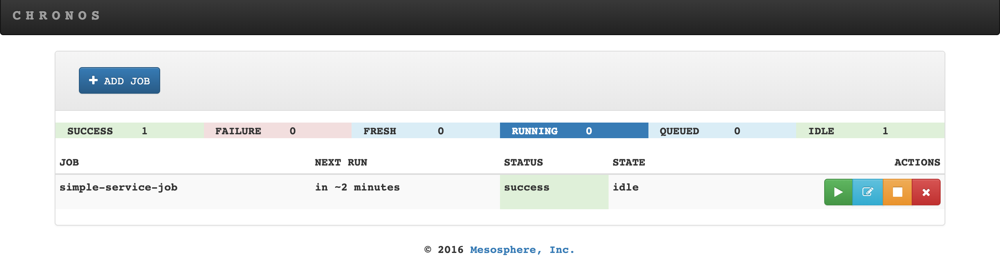
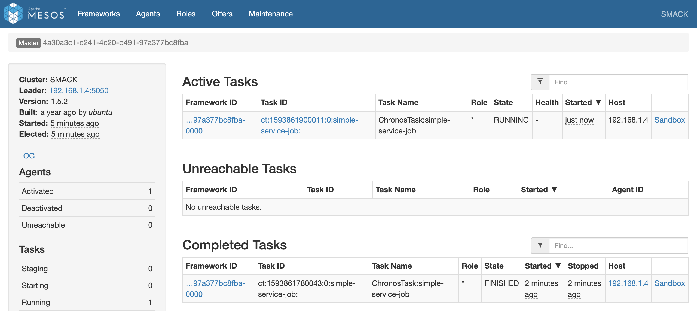

# springboot-mesos-chronos

The goal of this project is to create a simple [`Spring Boot`](https://docs.spring.io/spring-boot/docs/current/reference/htmlsingle/) Java application called `simple-service` and use [`Mesos`](http://mesos.apache.org) / [`Chronos`](https://mesos.github.io/chronos) to run it in specific intervals.

## Application

- ### simple-service

  It's a dummy and simple `Spring Boot` Java application. In order to simulate the finishing status of the application successfully or with an error, there is an environment variable `EXIT_CODE`. Besides, there is another environment variable called `SLEEP`. It can be used to change the amount of time the thread sleeps (in milliseconds). The idea of the `SLEEP` is to simulate the application processing time.

  The table below summarizes the environment variables.

  | Env. variable | Values                    | Default | Description                                                            |
  |---------------|---------------------------|---------|------------------------------------------------------------------------|
  | `EXIT_CODE`   | 0 = success; !0 = failure | 0       | For simulating the finishing status of the application                 |
  | `SLEEP`       | integer > 0               | 5000    | For simulating the application processing time (value in milliseconds) |

## Prerequisites

- [`Java 11+`](https://www.oracle.com/java/technologies/downloads/#java11)
- [`Docker`](https://www.docker.com/)
- [`Docker-Compose`](https://docs.docker.com/compose/install/)

## Mac Users

A new directory called `/var/lib` must be added to Docker `File Sharing` resources. For it, follow the steps below
- Go to **Docker Desktop** and open `Preferences...` > `Resources` > `File Sharing`
- Add `/var/lib`
- Click `Apply & Restart` button

## Start Environment

- Open a terminal and make sure you are in `springboot-mesos-chronos` root folder

- Export to an environment variable called `HOST_IP` the machine ip address
  ```
  export HOST_IP=$(ipconfig getifaddr en0)
  ```

- Run the following command
  ```
  docker-compose up -d
  ```
  > **Warning**: mesos-slave Docker container is not running, see [issues](#issues)

- Wait for Docker containers to be up and running. To check it, run
  ```
  docker-compose ps
  ```

## Service's URL

| Service | URL                   |
|---------|-----------------------|
| Mesos   | http://localhost:5050 |
| Chronos | http://localhost:4400 |

## Build Docker Image

- In a terminal, make sure you are inside `springboot-mesos-chronos` root folder

- Run the following script
  ```
  ./docker-build.sh
  ```

- You can check the application and Docker image by running
  ```
  docker run --rm --name simple-service \
    -e EXIT_CODE=0 -e SLEEP=1000 \
    ivanfranchin/simple-service:1.0.0; echo $?
  ```

## Running as a Chronos Job

- Edit some properties present in `chronos/simple-service.json`. For example, change the `schedule` to a specific date/time (UTC) in the future.

- In a terminal and, inside `springboot-mesos-chronos` root folder, run the `curl` command below to add jobs to `Chronos`.
  ```
  curl -i -X POST \
    -H "Content-Type: application/json" \
    -d@./chronos/simple-service.json \
    http://localhost:4400/v1/scheduler/iso8601
  ```
  > **Note:** For more about `Chronos` endpoints visit https://mesos.github.io/chronos/docs/api.html

- You can check and edit the schedule of the jobs by visiting [`Chronos` website](http://localhost:4400).

  

- To check the history of complete tasks, stderr and stdout of those tasks, etc, visit [`Mesos` website](http://localhost:5050).

  

## Shutdown

- In a terminal, make sure you are inside `springboot-mesos-chronos` root folder

- To stop and remove docker-compose containers, network and volumes, run
  ```
  docker-compose down -v
  docker rm -v $(docker ps -a -f status=exited -f status=created -q)
  ```

## Cleanup

- To remove the Docker images created in this project, go to a terminal and, inside `springboot-mesos-chronos` root folder, run the script below
  ```
  ./remove-docker-images.sh
  ```

- **Mac Users**

  Remove `/var/lib` added to Docker `File Sharing` resources
  - Go to **Docker Desktop** and open `Preferences...` > `Resources` > `File Sharing`
  - Remove `/var/lib` by clicking the `-` (minus) icon
  - Click `Apply & Restart` button

## Issues

The Docker container `mesos-slave` is not running. The log says
```
I0306 19:13:13.388301 34109 main.cpp:366] Version: 1.5.2
I0306 19:13:13.388335 34109 main.cpp:369] Git tag: 1.5.2
I0306 19:13:13.388352 34109 main.cpp:373] Git SHA: 3088295d4156eb58d092ad9b3529b85fd33bd36e
I0306 19:13:13.390044 34109 resolver.cpp:69] Creating default secret resolver
E0306 19:13:13.390632 34109 main.cpp:498] EXIT with status 1: Failed to create a containerizer: Could not create DockerContainerizer: Failed to create docker: Failed to find a mounted cgroups hierarchy for the 'cpu' subsystem; you probably need to mount cgroups manually
```
